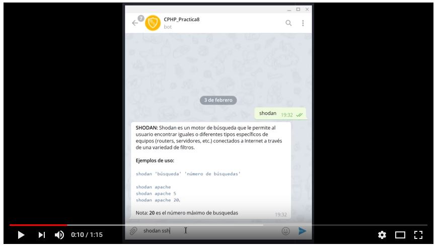

# Bot de Telegram sobre Shodan

## 1. Crear del Bot

1.1 - Buscar al **@botFather** en el Telegram


1.2 - Pulsar la opción de */newbot*


1.3 - Rellenar la información que pide **@botFather** y obtenemos el  **TOKEN** de nuestro **Bot**.

## 2. Añadir Comandos al Bot

> 1. Escribimos el comando **/mybots**.


> 2. Editamos el Bot pulsando en el botón **Edit Bot**


> 3. Pulsamos en el botón de **Edit Commands** y escribimos la lista de comandos con este formato:

```sh
shodan - búsqueda
autor - autor del bot
```


## 3. Obtención de la Api de Shodan

Ir a la web de https://account.shodan.io/ y copiamos el contenido de **API Key**

## 4. Añadir las claves de **shodan** y de **telegram** en los ficheros:

> *shodan-key.txt*

> *telegram-key.txt*

## 5. Instalación

**Raspberry Pi OS**:

```sh
sudo apt update -y
sudo apt install git -y
sudo apt install python3-pip -y
git clone https://github.com/rubenleon/Bot-Telegram-Shodan.git
cd Bot-Telegram-Shodan/
pip install -r requirements.txt
```

## 6. Ejecución del Bot

```sh
python start.py
```

## 7. Base de Datos

Para visualizar la Base de Datos utilizo la siguiente aplicación: https://sqlitebrowser.org/


## 8. Video del Bot en Acción

[](https://www.youtube.com/watch?v=Zpngydf6iwQ)

https://www.youtube.com/watch?v=Zpngydf6iwQ
