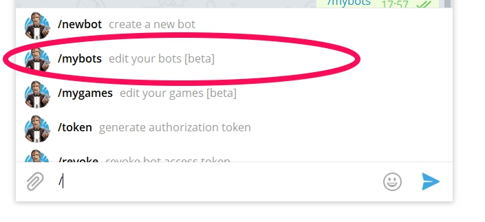
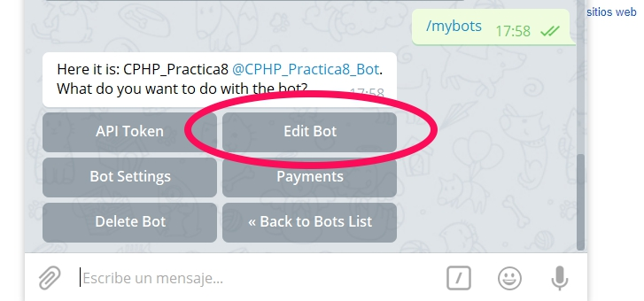
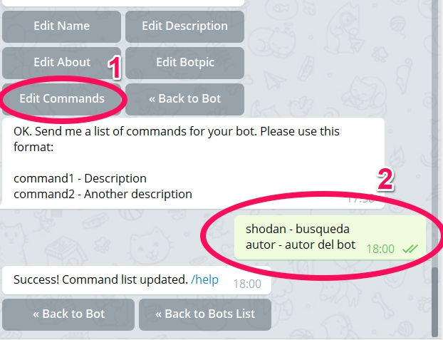

# Bot de Telegram de Hacking
> El bot de Telegram incluye herramientas como Shodan, DNS, Whois.

## Creación del Bot

Lo primero que tenemos que hacer es buscar al **@botFather** en el Telegram


Pulsamos la opción de */newbot*


Rellenamos la información que nos pide **@botFather** y nos dará **TOKEN** de nuestro BOT.

## Añadir Comandos al Bot

Lo primero que tenemos que hacer es buscar al **@botFather** en el Telegram







## Obtención de la Api de Shodan

Entramos en la web oficial de https://www.shodan.io/ y pulsamos en el botón **SHOW API KEY**

## Instalación

**Linux** (Ubuntu - Debian):

```sh
pip3 install pyTelegramBotAPI
```

```sh
pip3 install shodan
```

**Linux** (Arch Linux - Antergos):

```sh
pip install pyTelegramBotAPI
```

```sh
pip install shodan
```

## Documentación del Bot

Tenemos que añadir a la api de telegram y de shodan los siguientes ficheros:
*shodan-key.txt*
*telegram-key.txt*

Después ejecutamos el archivo de **inicio.py**

**Linux** (Ubuntu - Debian):

```sh
python3 inicio.py
```

**Linux** (Arch Linux - Antergos):

```sh
python inicio.py
```
